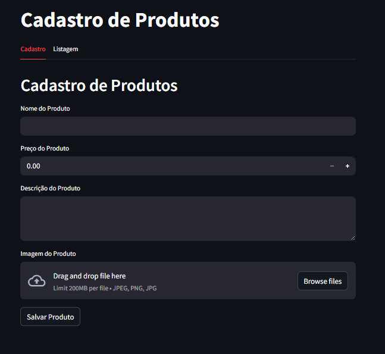
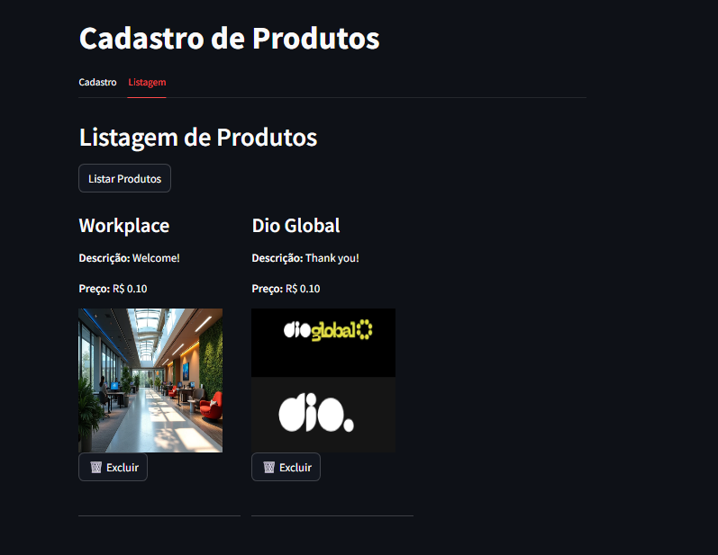
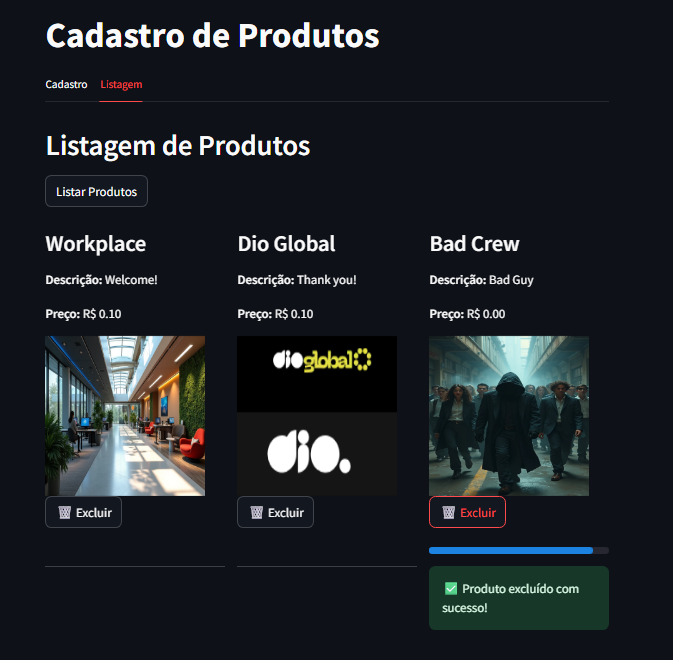

DIO - Cursos\\
Repositório para os cursos da DIO: Começando com o Microsoft Azure Cloud Native\\

🧪 DIO - Microsoft Azure Cloud Native: Lab 1\\
Projeto desenvolvido durante o curso da DIO sobre Microsoft Azure Cloud Native .\\

Objetivo do LAB\\
Criar uma infraestrutura no Azure para armazenamento de dados de um e-commerce fictício, utilizando Python com as seguintes tecnologias:\\

Streamlit : Interface web interativa\\
Azure Storage Blob : Armazenamento em nuvem para imagens.\\
pymssql : Conexão com banco de dados SQL Server no Azure.\\
python-dotenv : Gerenciamento de variáveis de ambiente.\\

O que aprendi:\\
Usar pymssql para conectar a aplicação Python ao SQL Server no Azure.\\
Rodar o projeto em uma máquina virtual Windows (VirtualBox), por conta da compatibilidade com Python 3.13.\\
Alguns pacotes exigem bibliotecas nativas (como FreeTDS).\\
É possível instalar dependências manualmente com MSYS2 e configurar variáveis de ambiente.\\
A importância do uso de ambientes virtuais (venv) para evitar conflitos entre projetos.\\

🎯 Objetivo\\
Criar uma interface web interativa usando Streamlit para cadastro de produtos, armazenando os dados em um banco de dados SQL Server no Azure e imagens no Azure Blob Storage\\

📦 Pacotes Utilizados\\
  1- streamlit: Interface web rápida e interativa\\
  2- azure-storage-blob: Upload e gerenciamento de arquivos no Azure Blob Storage\\
  3- pymssql: Conexão com SQL Server hospedado no Azure\\
  4- python-dotenv: Carregar variáveis de ambiente a partir do arquivo .env\\

⚠️ A versão do pymssql pode apresentar problemas de compilação no Windows. Solução usada: MSYS2 + FreeTDS . Alternativas futuras podem incluir pyodbc. \\

## 🖼️ Print do App Funcionando\\

  
*Tela principal da aplicação rodando localmente via `streamlit run main.py`.*

---

## 📷 Exemplo de Listagem de Produtos

  
*Listagem dos produtos cadastrados na interface do Streamlit.*

---

## ❌ Como Deletar um Produto

  
*Exemplo de como remover um produto do banco de dados usando a interface.*

