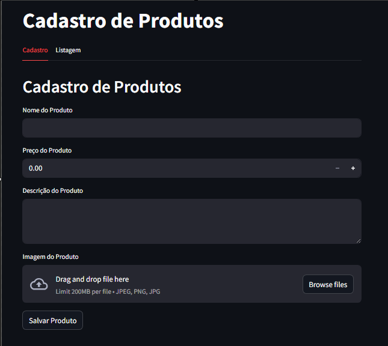
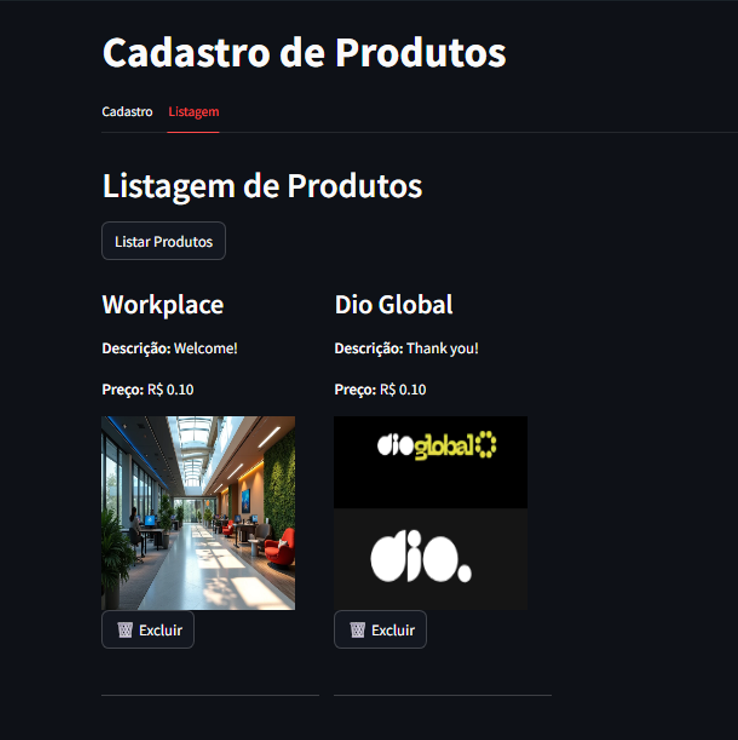
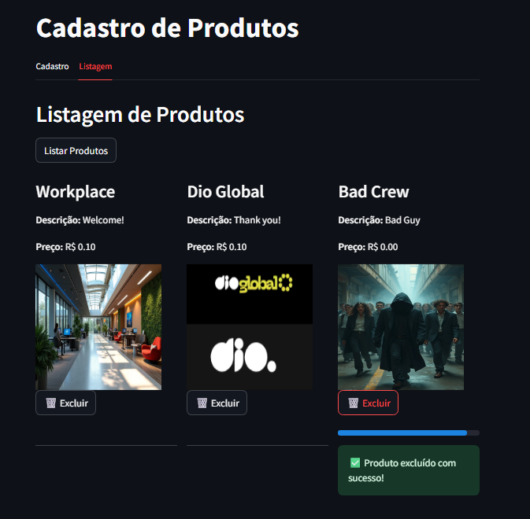

# DIO - Cursos

## Repositório para os cursos da DIO: Começando com o Microsoft Azure Cloud Native

### 🧪 DIO - Microsoft Azure Cloud Native: Lab 1

Projeto desenvolvido durante o curso da DIO sobre Microsoft Azure Cloud Native 

#### Objetivo do LAB 
Criar uma infraestrutura no Azure para armazenamento de dados de um e-commerce fictício, utilizando Python, Azure e SQL.

#### O que aprendi
* Usar pymssql para conectar a aplicação Python ao SQL Server no Azure
* Rodar o projeto em uma máquina virtual Windows (VirtualBox), por conta da incompatibilidade com Python 3.13.
* Alguns pacotes exigem bibliotecas nativas (como FreeTDS).
* É possível instalar dependências manualmente com MSYS2 e configurar variáveis de ambiente.
* A importância do uso de ambientes virtuais (venv) para evitar conflitos entre projetos.

#### 🎯 Desafio do Lab 

Criar uma interface web interativa usando Streamlit e Python para cadastro de produtos e imagens em um banco de dados SQL Server no Azure(Cloud/nuvem) com Azure Blob Storage

#### 📦 Pacotes Utilizados

* streamlit: Interface web rápida e interativa
* azure-storage-blob: Upload e gerenciamento de arquivos no Azure Blob Storage
* pymssql: Conexão com SQL Server hospedado no Azure
* python-dotenv: Carregar variáveis de ambiente a partir do arquivo .env

⚠️ A versão do pymssql pode apresentar problemas de compilação no Windows. Solução usada: MSYS2 + FreeTDS (Alternativas futuras podem incluir pyodbc).

## Vídeo do funcionamento do programa no VS Code e navegador web
[Youtube Video - Clique aqui para assistir](https://www.youtube.com/watch?v=KMIRbP-MutE    )

---

## 🖼️ Print do App Funcionando

### Tela do Streamlit feito no Python

<table>
  <tr>
    <td></td>
    <td></td>
    <td></td>
  </tr>
  <tr>
    <td style="text-align: center;">1- Tela inicial</td>
    <td style="text-align: center;">2- Listagem de produtos</td>
    <td style="text-align: center;">3- Deletar produto (É o botão "Excluir" que fica embaixo de cada imagem) </td>
  </tr>
</table>

---

### 🧾 Explicando o uso do Azure Blob Storage no projeto

**O que é o Azure Blob Storage?**
O Azure Blob Storage é um serviço da Microsoft Azure usado para armazenar grandes quantidades de dados não estruturados na nuvem, como textos, imagens, vídeos, documentos, backups e muito mais.

No contexto do nosso projeto, ele será responsável por armazenar as imagens dos produtos cadastrados via interface web (Streamlit), enquanto os dados dos produtos ficam em um banco de dados SQL Server também hospedado no Azure.

**Como funciona a arquitetura?**

1. **Interface Web (Streamlit)**
   * Desenvolvida com Python.
   * Permite ao usuário cadastrar, consultar e deletar produtos com nome, descrição, preço e imagem.

2. **Upload da Imagem**
   * A imagem selecionada pelo usuário é enviada diretamente para o Azure Blob Storage.
   * Após o upload, o serviço retorna uma URL pública ou SAS Token (dependendo da configuração) para acessar essa imagem.

3. **Cadastro no Banco de Dados**
   * Os dados do produto (nome, descrição, preço) são salvos no SQL Server no Azure.
   * A URL da imagem (gerada pelo Blob Storage) também é salva junto com esses dados.

4. **Exibição dos Produtos**
   * Quando a lista de produtos é carregada, o sistema busca as informações do banco de dados e exibe a imagem usando a URL armazenada.
