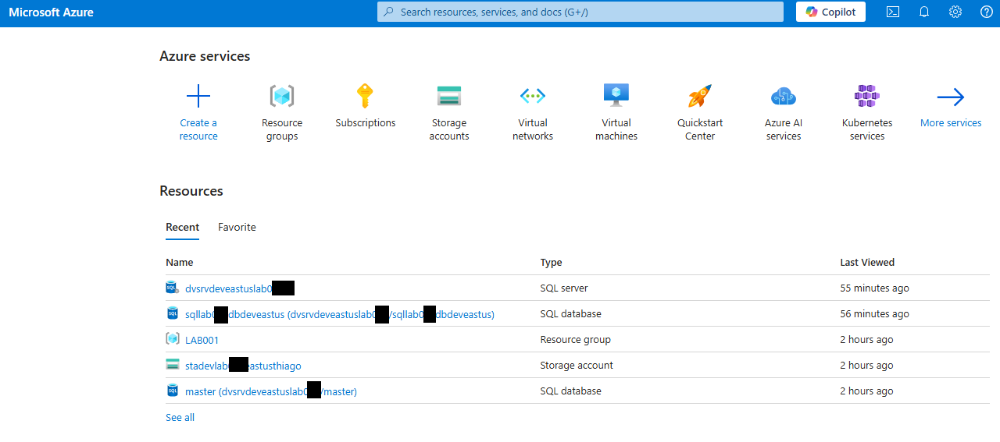
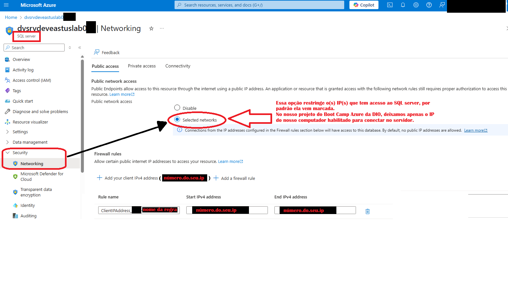
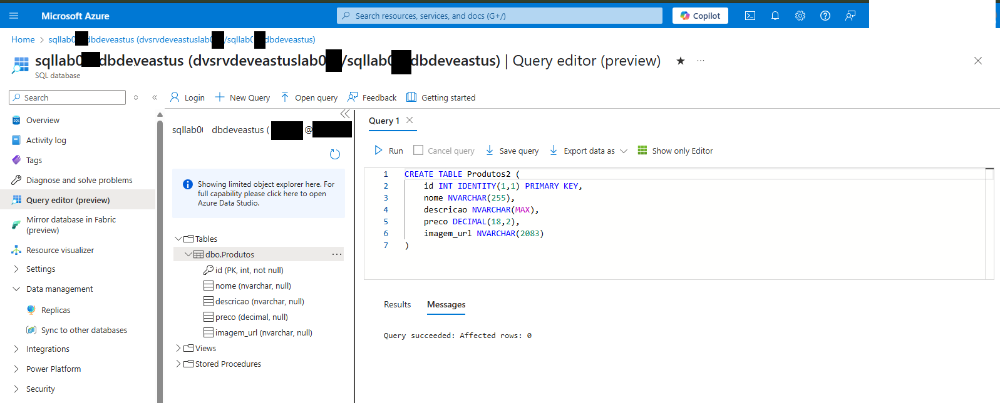
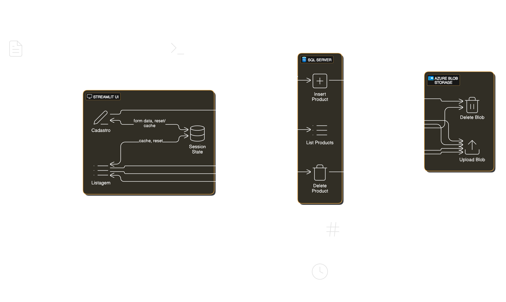
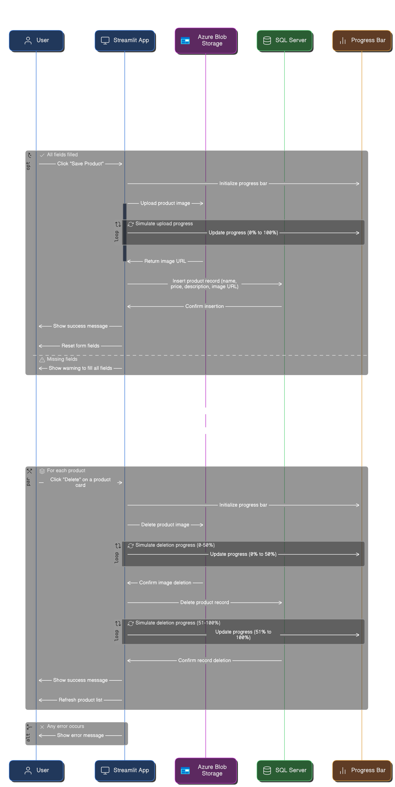

# 🧪 DIO - Microsoft Azure Cloud Native: Lab 1  
[](https://opensource.org/licenses/MIT)
 
[]()

### 📌 Repositório para os cursos da DIO: Começando com o Microsoft Azure Cloud Native

Projeto desenvolvido durante o curso **"Microsoft Azure Cloud Native"** da DIO. O objetivo foi construir uma aplicação web interativa com **Streamlit**, integrada ao **SQL Server no Azure** e utilizando o **Azure Blob Storage** para armazenamento de imagens.

---

## 📋 Índice

1. [🎯 Objetivo do Projeto](#objetivo-do-projeto)  
2. [💡 O Que Aprendi](#o-que-aprendi)  
3. [🧰 Pacotes Utilizados](#pacotes-utilizados)
4. [🖼️ Print do App Funcionando](#print-do-app-funcionando)  
5. [🎥 Vídeo do Funcionamento](#vídeo-do-funcionamento)  
6. [☁️ Azure](#parte-do-azure)  
7. [🗃️ SQL Server](#parte-do-sql-server)  
8. [🗄️ SQL Database](#parte-do-sql-database)  
9. [💾 Storage Account](#parte-do-storage-account)  
10. [🐍 Python](#parte-do-python)  
11. [🏗️ Arquitetura do Projeto](#arquitetura-do-projeto)  
12. [📌 Considerações Finais](#considerações-finais)

##### Obs.: Configurei regras de firewall no Azure para permitir acesso ao servidor somente a partir do meu IP público atual. Isso adiciona uma camada extra de segurança, pois, mesmo que alguém descubra o nome do servidor, usuário e senha, ele ainda precisaria estar conectando a partir de um IP autorizado. Porém, isso não elimina a necessidade de manter senhas seguras, usar autenticação multifatorial e controlar os acessos com políticas de segurança rigorosas. Os mascaramentos nas imagens são parte de uma campanha de conscientização em Segurança da Informação, alertando sobre os riscos de expor dados sensíveis desnecessariamente. 
---

## 1. <span id="objetivo-do-projeto">🎯 Objetivo do Projeto</span>

Criar uma infraestrutura no Azure para armazenamento de dados de um e-commerce fictício, utilizando:
- **Interface Web**: [Streamlit](https://streamlit.io/) (Python)
- **Banco de Dados**: SQL Server no Azure
- **Armazenamento de Imagens**: Azure Blob Storage

---

## 2. <span id="o-que-aprendi">💡 O Que Aprendi</span>

- Criar um servidor no Azure do zero  
- Conectar Python ao SQL Server no Azure usando `pymssql`
- Resolver problemas de compatibilidade com Python 3.13 no Windows  
- Configurar ambientes virtuais (`venv`) para evitar conflitos  
- Usar MSYS2 e FreeTDS para instalar bibliotecas nativas  
- Integrar interface web com serviços na nuvem (Azure)

---

## 3. <span id="pacotes-utilizados">🧰 Pacotes Utilizados</span>

| Pacote             | Finalidade |
|--------------------|------------|
| `streamlit`        | Interface web rápida e interativa |
| `pymssql`          | Conexão com SQL Server hospedado no Azure |
| `python-dotenv`    | Carregar variáveis de ambiente a partir do `.env` |

⚠️ *O `pymssql` pode apresentar problemas de compilação no Windows. Solução usada: MSYS2 + FreeTDS*

---
## 4. <span id="print-do-app-funcionando">🖼️ Print do App Funcionando</span>

### Tela do Streamlit feito no Python

<table>
  <tr>
    <td></td>
    <td></td>
    <td></td>
  </tr>
  <tr>
    <td style="text-align: center;">1- Tela inicial</td>
    <td style="text-align: center;">2- Listagem de produtos</td>
    <td style="text-align: center;">3- Deletar produto</td>
  </tr>
</table>

---

## 5. <span id="vídeo-do-funcionamento">🎥 Vídeo do Funcionamento</span>

[Youtube Video - Clique aqui para assistir](https://www.youtube.com/watch?v=KMIRbP-MutE)

[](https://www.youtube.com/watch?v=KMIRbP-MutE    )

---
## 6. <span id="parte-do-azure">☁️ Azure</span>

### 🖼️ Print do Portal do Azure (com mascaramento)

- Servidor SQL criado
- Banco de dados configurado



**Legenda:** "Servidor SQL no Azure com recursos configurados"

#### Detalhes Importantes:
- O **Resource Group** utilizado é `LAB001`.
- O **SQL Server** criado é `dvsrvdeveastuslab0**`.
- O **Storage Account** usado é `stadevlab0**eastusthiago`.
- As credenciais são gerenciadas por variáveis de ambiente via `.env`.

---

## 7. <span id="parte-do-sql-server">🗃️ SQL Server</span>

### 🔒 Configuração de Segurança do SQL Server

Para garantir a segurança do SQL Server, configurei as regras de firewall para permitir acesso apenas a endereços IP específicos. Isso evita acessos não autorizados à base de dados.

- **Opção Selecionada**: `Selected networks`
  - Essa opção restringe o acesso ao SQL Server apenas aos IPs configurados nas regras de firewall.

- **Regras de Firewall**:
  - Configurei uma regra de firewall para permitir acesso ao servidor apenas a partir do meu IP público atual. 
  - Isso significa que, mesmo que alguém descubra o nome do servidor, usuário e senha, ainda assim não será possível se conectar se o acesso não estiver vindo de um IP autorizado. 
  - Os mascaramentos nas imagens fazem parte de uma iniciativa de <mark>conscientização em Segurança da Informação </mark>, alertando sobre os riscos de expor dados sensíveis desnecessariamente — afinal, nenhuma medida isolada garante 100% de segurança. 




**Legenda:** "Configuração de firewall restrita para permitir acesso apenas ao IP do meu computador."

#### Por que É Importante?
- **Segurança**: Evita acessos não autorizados ao SQL Server.
- **Controle**: Garante que apenas o ambiente de desenvolvimento (meu computador) possa acessar o banco de dados.
- **Boas Práticas**: Segue recomendações de segurança para ambientes de nuvem.

---

## 8. <span id="parte-do-sql-database">🗄️ SQL Database </span>

### 📄 Query Simples Utilizada

Query SQL usada para criar a tabela de produtos:

```sql
CREATE TABLE Produtos (
    id INT IDENTITY(1,1) PRIMARY KEY,
    nome NVARCHAR(255),
    descricao NVARCHAR(MAX),
    preco DECIMAL(18,2),
    imagem_url NVARCHAR(2083)
);
```

#### Explicação:
- **Estrutura escolhida**: Facilita o cadastro e listagem de produtos.
- **Campo `imagem_url`**: Armazena a URL gerada pelo Blob Storage após o upload da imagem.

#### Print do Query Editor no Azure SQL Database



**Legenda:** "Query sendo executada no Query Editor do Azure SQL Database."

#### Executando a Query no Azure SQL Database

A query foi executada diretamente no **Query Editor** do Azure SQL Database, sem a necessidade de ferramentas externas como SSMS ou Azure Data Studio. Isso facilita o desenvolvimento e testes rápidos durante o projeto.

---

## 9. <span id="parte-do-storage-account">💾 Storage Account</span>

### 📁 Tipos de Armazenamento Disponíveis

O **Storage Account** oferece várias opções de armazenamento:
- **Blob Storage**: Para armazenar arquivos grandes (como imagens).
- **File Storage**: Para compartilhamentos de arquivos.
- **Queue Storage**: Para filas de mensagens.
- **Table Storage**: Para armazenamento de tabelas não relacionais.

#### Mas utilizamos apenas o **Blob Storage**

- **Motivo**: Ideal para armazenar imagens e arquivos binários.
- As URLs das imagens são salvas no campo `ImagemURL` da tabela `Produtos` no SQL Server.

---

## 10. <span id="parte-do-python">🐍 Pthon</span>

### 🧱 Estrutura do Código

Todo o código do projeto está concentrado no arquivo **`main.py`**, que contém:
- A interface web feita com **Streamlit**
- Funções para conectar ao **SQL Server no Azure**
- Integração com o **Azure Blob Storage** para upload e recuperação de imagens
- Uso de variáveis de ambiente via `.env` para segurança

#### Arquivo Principal:
| Arquivo | Descrição |
|--------|-----------|
| `main.py` | Interface web + lógica de conexão SQL e Blob Storage |
| `.env` | Armazena credenciais sensíveis (chaves, strings de conexão) |

---

## 📜 Principais Trechos de Código

### ⚙️ Configuração Inicial

```python
import streamlit as st
from azure.storage.blob import BlobServiceClient
import os
import pymssql
import uuid
from dotenv import load_dotenv
import time

load_dotenv()
```

**O que faz:**
- Importa bibliotecas essenciais.
- Carrega as variáveis de ambiente do arquivo `.env`.

---

### 🔐 Variáveis de Ambiente

```python
# Configurações do Azure
BlobConnectionString = os.getenv('BLOB_CONNECTION_STRING')
blobContainerName = os.getenv('BLOB_CONTAINER_NAME')
blobaccountName = os.getenv('BLOB_ACCOUNT_NAME')

SQL_SERVER = os.getenv('SQL_SERVER')
SQL_DATABASE = os.getenv('SQL_DATABASE')
SQL_USER = os.getenv('SQL_USER')
SQL_PASSWORD = os.getenv("SQL_PASSWORD")
```

**O que faz:**
- Carrega as credenciais e configurações do Azure a partir do arquivo `.env`.
- Mantém informações sensíveis fora do código-fonte.

---

### 📤 Upload de Imagem com Progresso

```python
def upload_blob(file, progress_bar):
    blob_service_client = BlobServiceClient.from_connection_string(BlobConnectionString)
    container_client = blob_service_client.get_container_client(blobContainerName)
    blob_name = str(uuid.uuid4()) + file.name
    blob_client = container_client.get_blob_client(blob_name)

    for percent_complete in range(0, 101, 10):
        time.sleep(0.03)
        progress_bar.progress(percent_complete)

    blob_client.upload_blob(file.read(), overwrite=True)
    image_url = f"https://{blobaccountName}.blob.core.windows.net/{blobContainerName}/{blob_name}"
    return image_url
```

**O que faz:**
- Faz o upload de uma imagem para o **Azure Blob Storage**.
- Retorna a URL pública da imagem para armazenamento no banco de dados.

---

### 📥 Inserção no Banco de Dados

```python
def insert_product(product_name, product_price, product_description, product_image, progress_bar):
    image_url = upload_blob(product_image, progress_bar)
    conn = pymssql.connect(server=SQL_SERVER, user=SQL_USER, password=SQL_PASSWORD, database=SQL_DATABASE)
    cursor = conn.cursor()
    cursor.execute(
        "INSERT INTO Produtos (nome, preco, descricao, imagem_url) VALUES (%s, %s, %s, %s)",
        (product_name, product_price, product_description, image_url)
    )
    conn.commit()
    conn.close()
    return True
```

**O que faz:**
- Conecta ao SQL Server no Azure.
- Salva os dados do produto no banco de dados.
- Associa a URL da imagem (do Blob Storage) ao registro do produto.

---

### 🗑️ Exclusão de Produto

```python
def delete_product_from_sql(product_id):
    conn = pymssql.connect(server=SQL_SERVER, user=SQL_USER, password=SQL_PASSWORD, database=SQL_DATABASE)
    cursor = conn.cursor()
    cursor.execute("DELETE FROM Produtos WHERE id = %d", (product_id,))
    conn.commit()
    conn.close()
    return True
```

**O que faz:**
- Remove o registro do produto no SQL Server quando o usuário clica em “Excluir”.

---

### 📷 Exclusão da Imagem no Blob

```python
def delete_blob(blob_name):
    blob_service_client = BlobServiceClient.from_connection_string(BlobConnectionString)
    container_client = blob_service_client.get_container_client(blobContainerName)
    blob_client = container_client.get_blob_client(blob_name)
    
    if blob_client.exists():
        blob_client.delete_blob()
    return True
```

**O que faz:**
- Remove a imagem associada ao produto no Azure Blob Storage.

---

## 11. <span id="arquitetura-do-projeto">🏗️ Arquitetura do Projeto</span>

Aqui estão os diagramas que ilustram a arquitetura e o fluxo de trabalho do projeto:

### 1. Diagrama Geral da Arquitetura



**Legenda:**
- **dotenv**: Carrega variáveis de ambiente.
- **os**: Fornece configurações para o SQL Server.
- **STREAMLIT UI**: Interface principal com cadastro e listagem de produtos.
- **SQL SERVER**: Gerencia operações no banco de dados.
- **AZURE BLOB STORAGE**: Armazena imagens dos produtos.

### 2. Fluxo de Trabalho Detalhado

#### a. Fluxo Geral de Registro e Gestão de Produtos


**Legenda:**
- **User**: Interage com a interface Streamlit.
- **Streamlit App**: Gerencia a lógica da aplicação.
- **Azure Blob Storage**: Armazena imagens dos produtos.
- **SQL Server**: Armazena metadados dos produtos.
- **Progress Bar**: Exibe o progresso das operações de upload e exclusão.

#### b. Detalhes do Fluxo de Registro e Gestão



**Legenda:**
- **Registro de Produto**:
  - O usuário preenche um formulário com detalhes do produto.
  **Upload de Imagem**: A imagem é enviada para o Azure Blob Storage.
  **Salvar no SQL Server**: Os metadados são salvos no SQL Server.
- **Listagem de Produtos**:
  - A lista de produtos é recuperada do SQL Server.
  - As imagens são exibidas usando URLs do Blob Storage.
- **Exclusão de Produto**:
  - A imagem é excluída do Blob Storage.
  - O registro é removido do SQL Server.

# 12. <span id="considerações-finais">📌 Considerações Finais</span>

Esse projeto me permitiu aprender sobre integração entre aplicações locais (Python) e serviços na nuvem (Azure), além de lidar com problemas reais de compatibilidade e segurança ao trabalhar com APIs e credenciais sensíveis.
Obrigado DIO e a todos envolvidos!
